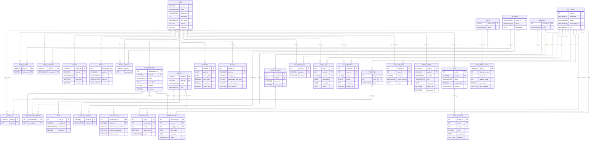

# Entity Relationship Diagram

```mermaid
---
config:
  layout: elk
---
erDiagram
  PARK {
    CHAR(36) park_id PK
    VARCHAR(150) name
    VARCHAR(50) designation
    TEXT description
    VARCHAR(50) park_code
    DECIMAL latitude
    DECIMAL longitude
  }

  STATE {
    CHAR(2) state_code PK
    VARCHAR(50) name
  }

  PARK_STATE {
    CHAR(36) park_id FK
    CHAR(2) state_code FK
  }

  ACTIVITY {
    VARCHAR(50) activity_id PK
    VARCHAR(100) name
    TEXT description
  }

  PARK_ACTIVITY {
    CHAR(36) park_id FK
    VARCHAR(50) activity_id FK
  }

  PARK_TAG {
    CHAR(36) park_id FK
    INT tag_id FK
  }

  EVENT {
    CHAR(36) event_id PK
    CHAR(36) park_id FK
    VARCHAR(150) title
    DATETIME start_time
    DATETIME end_time
  }

  IMAGE {
    INT image_id PK
    CHAR(36) park_id FK
    VARCHAR(255) url
    VARCHAR(255) alt_text
    VARCHAR(150) credit
  }

  AMENITY {
    INT amenity_id PK
    VARCHAR(100) name
  }

  PARK_AMENITY{
    CHAR(36) park_id 
    INT amenity_id
  }

  CAMPGROUND {
    INT campground_id PK
    CHAR(36) park_id FK
    VARCHAR(150) name
    TEXT description
    DECIMAL latitude
    DECIMAL longitude
  }

  CAMPGROUND_AMENITY {
    INT campground_id FK
    INT amenity_id FK
  }

  FACILITY {
    CHAR(36) facility_id PK
    CHAR(36) park_id FK
    VARCHAR(255) name
    VARCHAR(50) type
  }

  FEE {
    INT fee_id PK
    CHAR(36) facility_id FK
    VARCHAR(255) description
    DECIMAL amount
  }

  FACILITY_ACTIVITY {
    CHAR(36) facility_id FK
    VARCHAR(50) activity_id FK
  }

  ACCESSIBILITY {
    INT accessibility_id PK
    CHAR(36) facility_id FK
    TINYINT(1) wheelchair_accessible
    TINYINT(1) audio_descriptions
    TINYINT(1) tactile_exhibits
  }

  WEATHER {
    INT weather_id PK
    CHAR park_id FK
    DATE record_date
    DECIMAL temp_high
    DECIMAL temp_low
    DECIMAL precip_mm
  }

  SAFETY {
    INT safety_id PK
    CHAR(36) park_id FK
    DECIMAL safety_score
    TINYINT earthquake_risk_level
    TINYINT weather_risk_level
    DATETIME last_updated
  }

  APP_USER {
    INT user_id PK
    VARCHAR(50) username
    VARCHAR(100) email
    VARCHAR(255) password_hash
    VARCHAR(20) role
  }

  USER_SESSION {
    INT session_id PK
    INT user_id FK
    DATETIME login_time
    DATETIME logout_time
  }

  ACTIVITY_LOG {
    INT log_id PK
    INT session_id FK
    INT user_id FK
    DATETIME action_time
    VARCHAR(255) action
  }

  FAVORITE_PARK {
    INT user_id FK
    CHAR(36) park_id FK
    DATETIME created_at
  }

  RESERVATION {
    INT reservation_id PK
    INT user_id FK
    INT campground_id FK
    DATE start_date
    DATE end_date
    VARCHAR(20) status
  }

  TRIP_LOG {
    INT trip_id PK
    INT user_id FK
    CHAR(36) park_id FK
    DATE start_date
    DATE end_date
    TEXT notes
  }

  PARK_REVIEW {
    INT review_id PK
    INT user_id FK
    CHAR(36) park_id FK
    TINYINT rating
    TEXT review_text
    DATETIME created_at
  }

  USER_TAG {
    INT tag_id PK
    INT user_id FK
    VARCHAR(50) label
  }

  WISHLIST_TRIP {
    INT wishlist_id PK
    INT user_id FK
    CHAR(36) park_id FK
    VARCHAR(20) target_season
    TEXT notes
  }

  PARK_ALERT {
    CHAR(36) alert_id PK
    CHAR(36) park_id FK
    VARCHAR(50) category
    VARCHAR(150) title
    TEXT description
    DATETIME issued_at
    DATETIME expires_at
  }

  TRAIL {
    INT trail_id PK
    CHAR(36) park_id FK
    VARCHAR(150) name
    DECIMAL length_miles
    VARCHAR(20) difficulty
  }

  TRAIL_REVIEW {
    INT review_id PK
    INT trail_id FK
    INT user_id FK
    TINYINT rating
    TEXT review_text
    DATETIME created_at
  }

  PARK_POPULARITY {
    CHAR(36) park_id PK
    INT favorites_count
    INT visit_count
    INT review_count
    DECIMAL avg_rating
    DATETIME last_updated
  }

  %% ============================
  %% RELATIONSHIPS (crow's foot)
  %% ============================

  PARK ||--o{ PARK_STATE : "in"
  STATE ||--o{ PARK_STATE : "has"

  PARK ||--o{ PARK_ACTIVITY : "offers" 
  ACTIVITY ||--o{ PARK_ACTIVITY : "used_for"

  PARK ||--o{ WEATHER : "records"
  PARK ||--o{ EVENT : "hosts"
  PARK ||--o{ CAMPGROUND : "has"
  PARK ||--o{ IMAGE : "has"
  PARK ||--o{ SAFETY : "scored_by"

  CAMPGROUND ||--o{ CAMPGROUND_AMENITY : "has"
  CAMPGROUND_AMENITY ||--o{ CAMPGROUND : "used_in"
  AMENITY ||--o{ CAMPGROUND_AMENITY : used_in
  PARK ||--o{ PARK_AMENITY : "has"
  PARK_AMENITY ||--o{ PARK : "used_in"
  AMENITY ||--o{ PARK_AMENITY : used_in

  PARK ||--o{ FACILITY : "has"
  FACILITY ||--o{ FEE : "charges"
  FACILITY ||--o{ FACILITY_ACTIVITY : "supports"
  ACTIVITY ||--o{ FACILITY_ACTIVITY : "available_at"
  FACILITY ||--o{ ACCESSIBILITY : "described_by"


  PARK ||--o{ PARK_ALERT : "has_alert"
  PARK ||--o{ TRAIL : "has_trail"

  TRAIL ||--o{ TRAIL_REVIEW : "reviewed_in"
  APP_USER ||--o{ TRAIL_REVIEW : "writes"

  PARK ||--|| PARK_POPULARITY : "has_metrics"

  APP_USER ||--o{ USER_SESSION : "started_by"
  USER_SESSION ||--o{ ACTIVITY_LOG : "has"
  APP_USER ||--o{ ACTIVITY_LOG : "creates"

  APP_USER ||--o{ FAVORITE_PARK : "favorites"
  PARK ||--o{ FAVORITE_PARK : "liked_by"

  APP_USER ||--o{ RESERVATION : "makes"
  CAMPGROUND ||--o{ RESERVATION : "booked_in"

  APP_USER ||--o{ TRIP_LOG : "logs"
  PARK ||--o{ TRIP_LOG : "visited_in"

  APP_USER ||--o{ PARK_REVIEW : "writes"
  PARK ||--o{ PARK_REVIEW : "reviewed_in"

  APP_USER ||--o{ USER_TAG : "creates"
  USER_TAG ||--o{ PARK_TAG : "applied_in"
  PARK ||--o{ PARK_TAG : "tagged_with"

  APP_USER ||--o{ WISHLIST_TRIP : "wants"
  PARK ||--o{ WISHLIST_TRIP : "planned_for"
```
