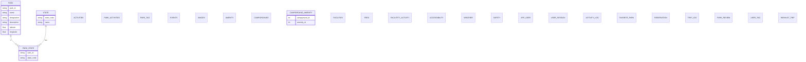

# Entity Relationship Diagram

```mermaid
erDiagram
  PARK {
    string park_id
    string name
    string designation
    string description
    float latitude
    float longitude
  }

  STATE {
    string state_code
    string name
  }

  PARK_STATE {
    string park_id
    string state_code
  }

   ACTIVITIES {

  }

  PARK_ACTIVITIES {
    
  }

  PARK_TAG {

  }

  EVENTS {

  }

  IMAGES {

  }

  AMENITY {

  }

  CAMPGROUNDS {

  }

  CAMPGROUND_AMENITY {
    int campground_id
    int amenity_id
  }

  FACILITIES {

  }

  FEES {

  }

  FACILITITY_ACTIVITY {

  }

  ACCESSIBILITY {

  }

  WEATHER {

  }

  SAFETY {

  }

  APP_USER {

  }

  USER_SESSION{

  }

  ACTIVITY_LOG {

  }

  FAVORITE_PARK {

  }

  RESERVATION {

  }

  TRIP_LOG {

  }

  PARK_REVIEW {
    
  }

  USER_TAG {

  }

  WISHLIST_TRIP {

  }

  PARK ||--o{ PARK_STATE : in
  STATE ||--o{ PARK_STATE : has
```
